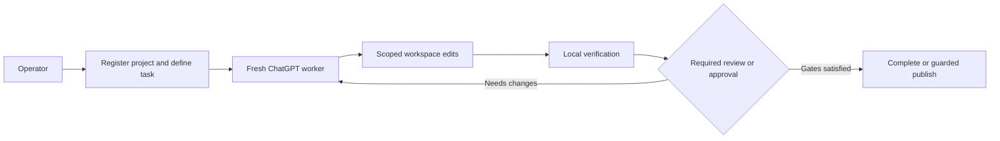

# OrchKit

**A durable local control plane for scoped, verifiable development work across fresh ChatGPT conversations.**

OrchKit keeps workflow authority outside the chat: a new ChatGPT conversation handles each task or repair attempt, while task state, verification evidence, approvals, and publication state remain in a local SQLite ledger. The command-line interface is `orch`.

## Who it is for

OrchKit is for maintainers who want a local, inspectable process for development tasks that span more than one model conversation. It is useful when a task needs an explicit write scope, independently run checks, a review or owner-approval gate, and optionally guarded Git publication.

It is not a service for running untrusted code, a multi-tenant platform, or a replacement for an operating-system sandbox.

## Status and support

This is an early public source release. The implementation is developed and tested primarily in a macOS-oriented environment with Python 3.9+ and Git. No package release, platform support matrix, or compatibility guarantee is published yet.

Use the issue tracker for reproducible source-level defects and improvement proposals. Read [CONTRIBUTING.md](CONTRIBUTING.md) before opening a change, and use [SECURITY.md](SECURITY.md) for security-sensitive concerns.

## Quick start from source

Clone the repository and install its local source package into a virtual environment:

```sh
git clone https://github.com/RaNDoM6913/OrchKit.git
cd OrchKit
python3 -m venv .venv
source .venv/bin/activate
python -m pip install .
orch --version
```

Choose a local directory for OrchKit state, then initialize it without touching a project:

```sh
export ORCH_HOME="$HOME/.orchkit"
orch setup --profile safe
orch doctor --skip-codex
```

The state directory contains local workflow authority and private artifacts. Keep it outside a repository and do not commit it. `--skip-codex` skips the optional Codex subscription preflight; Codex is not required for the core workflow.

Before registering a project, review the available commands and the workflow model:

```sh
orch project add --help
orch queue enqueue --help
orch rdc bootstrap-prompt
```

## How the workflow works



The diagram reflects the implemented workflow boundaries:

1. An operator registers a Git workspace and defines a bounded task, including allowed paths and verification commands.
2. A fresh ChatGPT conversation claims one task attempt and receives bounded durable context from the local ledger.
3. The worker submits a receipt and relinquishes its capability; that receipt is not treated as proof.
4. OrchKit verifies actual workspace state and registered checks, then binds any required review or owner approval to the verified snapshot.
5. A task can complete, or publish through the configured Git policy, only after its gates are satisfied.

See the [workflow guide](docs/workflow.md) and [architecture](docs/architecture.md) for the component and authority boundaries.

## Workflow-level protections

The current implementation is designed to provide:

- one active writer reservation for a shared project authority;
- explicit allowed paths and protected pre-existing content;
- an admitted bounded-task contract with acceptance criteria, non-goals, advisory execution-budget provenance, and per-check timeout/output/recovery metadata visible through queue readback;
- local verification of the workspace and registered commands after the worker has quiesced;
- review and owner approval bound to the verified snapshot;
- guarded Git publication with an expected base, empty pre-existing staging, exact changed-path staging, ordinary non-force push, and remote-ref verification;
- recovery states for uncertain outcomes instead of silently treating them as success.

Execution-budget metadata is currently advisory: it does not stop a worker, expire a writer reservation, or prove that an external/direct-RDC process has stopped. These are workflow controls. They do not make a worker trustworthy by assertion, and they do not turn same-user terminal access into a security boundary.

## Security boundary

OrchKit is **not** an operating-system sandbox. A process with broad shell access under the same operating-system user can potentially access files or processes outside OrchKit's intended workflow. Helper allowlists, local file modes, and task capabilities are cooperative controls, not a separate security principal.

Do not use the current design to execute adversarial workloads or to protect credentials from a same-user process. Stronger isolation requires a separate operating-system identity or an isolated execution environment. Details and reporting guidance are in the [security model](docs/security-model.md) and [SECURITY.md](SECURITY.md).

## Documentation

- [Documentation index](docs/README.md)
- [Workflow guide](docs/workflow.md)
- [Architecture](docs/architecture.md)
- [Security model](docs/security-model.md)
- [Roadmap](ROADMAP.md)
- [Changelog](CHANGELOG.md)

## License

OrchKit is licensed under the [Apache License 2.0](LICENSE).
