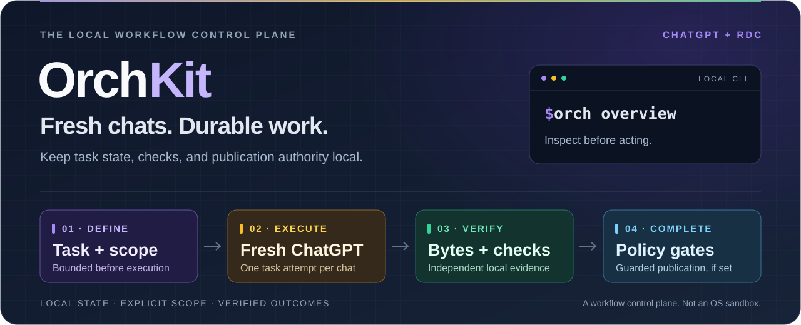
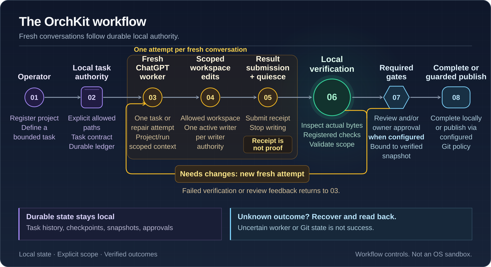

# OrchKit

> **Fresh chats. Durable work.** A local control plane for scoped, verifiable development across ChatGPT conversations.

<div align="center">

<a href="https://github.com/RaNDoM6913/OrchKit/actions/workflows/compatibility.yml"></a>
[](https://github.com/RaNDoM6913/OrchKit/tree/v0.11.0)
[](LICENSE)

[](docs/compatibility.md)
[](docs/workflow.md)

[🚀 Install](#install) · [⚡ Quick Start](#quick-start) · [📖 Documentation](docs/README.md) · [🧭 Delivery Plan](docs/implementation-plan.md) · [📋 Changelog](CHANGELOG.md)

<p>
  
</p>

<sub><a href="https://pypi.org/project/orchkit/0.11.0/">PyPI 0.11.0</a> · <a href="https://github.com/RaNDoM6913/OrchKit/releases/tag/v0.11.0">GitHub Release</a> · macOS arm64 verification</sub>

</div>

---

OrchKit keeps workflow authority outside the chat: each task or repair attempt starts in a fresh conversation, while task state, verification evidence, approvals, and publication state remain in a local SQLite ledger. The terminal command is **`orch`**.

<table>
<tr>
<td width="50%" valign="top">

### 🧭 Durable context
New conversation, same recorded task history. Plans, receipts, checkpoints, and recovery evidence stay local.

</td>
<td width="50%" valign="top">

### 🎯 Explicit write scope
Bounded tasks, allowed paths, and one writer reservation per shared workspace authority. No time-based lease expiry.

</td>
</tr>
<tr>
<td width="50%" valign="top">

### 🔎 Evidence before completion
The verifier checks actual workspace bytes and registered commands. A worker's receipt is not proof.

</td>
<td width="50%" valign="top">

### 🛡️ Guarded publication
Required gates bind to the verified snapshot. Git publication uses exact staging, ordinary pushes, and remote readback.

</td>
</tr>
</table>

---

## Who it is for

OrchKit is for maintainers who want a local, inspectable process for development tasks that span more than one model conversation. It is useful when a task needs an explicit write scope, independently run checks, a review or owner-approval gate, and optionally guarded Git publication.

It is not a service for running untrusted code, a multi-tenant platform, or a replacement for an operating-system sandbox.

## Status and support

**OrchKit 0.11.0 is published.** The frozen [source tag](https://github.com/RaNDoM6913/OrchKit/tree/v0.11.0) was created on October 5, 2026, from commit `00468b52f8bc55462951036577e8774074ef7529`. The matching [PyPI distribution](https://pypi.org/project/orchkit/0.11.0/) and [GitHub Release](https://github.com/RaNDoM6913/OrchKit/releases/tag/v0.11.0) were published on October 8, 2026.

Release verification currently covers macOS arm64 with CPython 3.9 through 3.14; other platforms, architectures, and later interpreter versions remain unverified. The package is published as `orchkit` on PyPI and installs the `orch` CLI. See the [compatibility matrix](docs/compatibility.md) for exact test points and boundaries.

Use the issue tracker for reproducible source-level defects and improvement proposals. Read [CONTRIBUTING.md](CONTRIBUTING.md) before opening a change, and use [SECURITY.md](SECURITY.md) for security-sensitive concerns.

## Install

For everyday terminal use, install the published 0.11.0 package in an isolated environment with [pipx](https://pipx.pypa.io/):

```sh
pipx install 'orchkit==0.11.0'
orch --version
```

Need pipx first? On macOS with Homebrew, run `brew install pipx`, then `pipx ensurepath` and open a new terminal. No OrchKit-specific Homebrew formula is provided in this release.

The [installation guide](docs/installation.md) also covers dedicated virtual environments, release-tag/source installs, command-path troubleshooting, safe updates, and removal. Installing the package does not initialize state or start workers.

## Quick start

Choose a local directory for OrchKit state, initialize it, then ask the read-only overview what is still missing:

```sh
export ORCH_HOME="$HOME/.local/share/orchkit-state"
orch setup --profile safe
orch doctor --skip-codex
orch overview
```

This setup example is for a new installation. Existing users should keep their established `ORCH_HOME` and inspect it before making changes.

The state directory contains local workflow authority and private artifacts. Keep it outside a repository and do not commit it. `--skip-codex` explicitly skips the optional Codex reviewer checks; after the RDC binding is recorded, a missing Codex installation does not keep the core workflow in an attention state.

Connect the ordinary ChatGPT/RDC route by generating the bootstrap prompt and running that prompt in a fresh ordinary ChatGPT conversation with Remote Desktop Commander connected:

```sh
orch rdc bootstrap-prompt
```

Then register a Git repository. Review mode off does not require Codex; optional review can be enabled later:

```sh
orch project add /absolute/path/to/repository --review-mode off
```

Copy the returned top-level `project_id`, render the project-scoped worker prompt, and inspect readiness:

```sh
PROJECT_ID="<returned-project-id>"
orch dispatcher render --project "$PROJECT_ID"
orch overview --project "$PROJECT_ID"
```

When the overview reports that the project is ready for work, add a bounded task and check the control view again:

```sh
orch queue enqueue "$PROJECT_ID" \
  --task-id FIRST-TASK \
  --goal "Describe one bounded change" \
  --allowed-path README.md
orch overview --project "$PROJECT_ID"
```

`orch overview` is an inspection command: it does not initialize a missing ledger, recreate damaged runtime directories, or migrate an old ledger just because the operator asked for status. Its `next_steps` field points to the next explicit setup, connection, task, or recovery action.

## How the workflow works

<p align="center">
  
</p>

The diagram reflects the implemented workflow boundaries:

1. An operator registers a Git workspace and defines a bounded task, including allowed paths and verification commands.
2. A fresh ChatGPT conversation claims one task attempt and receives bounded durable context from the local ledger.
3. The worker submits a receipt and relinquishes its capability; that receipt is not treated as proof.
4. OrchKit verifies actual workspace state and registered checks, then binds any required review or owner approval to the verified snapshot.
5. A task can complete, or publish through the configured Git policy, only after its gates are satisfied.

See the [workflow guide](docs/workflow.md) and [architecture](docs/architecture.md) for the component and authority boundaries.

## Workflow-level protections

The current implementation is designed to provide:

- one active writer reservation for a shared project authority;
- explicit allowed paths and protected pre-existing content;
- an admitted bounded-task contract with acceptance criteria, non-goals, advisory execution-budget provenance, and per-check timeout/output/recovery metadata visible through queue readback;
- local verification of the workspace and registered commands after the worker has quiesced;
- review and owner approval bound to the verified snapshot;
- guarded Git publication with an expected base, empty pre-existing staging, exact changed-path staging, ordinary non-force push, and remote-ref verification;
- recovery states for uncertain outcomes instead of silently treating them as success.

Execution-budget metadata is currently advisory: it does not stop a worker, expire a writer reservation, or prove that an external/direct-RDC process has stopped. These are workflow controls. They do not make a worker trustworthy by assertion, and they do not turn same-user terminal access into a security boundary.

## Security boundary

OrchKit is **not** an operating-system sandbox. A process with broad shell access under the same operating-system user can potentially access files or processes outside OrchKit's intended workflow. Helper allowlists, local file modes, and task capabilities are cooperative controls, not a separate security principal.

Do not use the current design to execute adversarial workloads or to protect credentials from a same-user process. Stronger isolation requires a separate operating-system identity or an isolated execution environment. Details and reporting guidance are in the [security model](docs/security-model.md) and [SECURITY.md](SECURITY.md).

## What comes next

The CLI is the foundation, not a temporary prototype. The next engineering milestone is a disposable three-project concurrency proof, followed by a transport abstraction and local Bridge. A terminal dashboard or SwiftUI macOS app would be an optional interface over the same core, not a second implementation of writer locks or release policy.

**Not included in 0.11.0:** a native Bridge/MCP connector, a macOS app, same-repository parallel writers, or multi-device scheduling. See the [multi-project plan](docs/multi-project-bridge.md) and [interface strategy](ROADMAP.md#distribution-and-interfaces).

## Documentation

- [Installation and updates](docs/installation.md)
- [Documentation index](docs/README.md)
- [Workflow guide](docs/workflow.md)
- [Architecture](docs/architecture.md)
- [Security model](docs/security-model.md)
- [Compatibility](docs/compatibility.md)
- [Release process](docs/release-process.md)
- [Roadmap](ROADMAP.md)
- [Changelog](CHANGELOG.md)

## License

OrchKit is licensed under the [Apache License 2.0](LICENSE).
