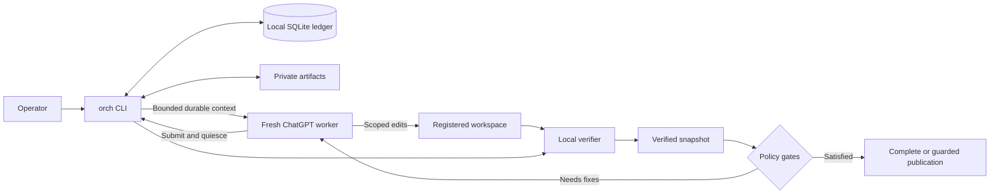

# Architecture

OrchKit is a local control plane for durable, scope-bounded development work performed across fresh ChatGPT conversations.

The core design separates transient conversations from durable workflow authority. Chat history is not the workflow database.

## Components

- **`orch` CLI** — operator and worker entry point for setup, project registration, queue operations, verification, recovery, and publication.
- **Local SQLite ledger** — durable task, run, event, approval, snapshot, and publication state.
- **Private OrchKit artifacts** — capability files, receipts, logs, review exports, dispatcher data, and backups stored outside the project workspace.
- **Fresh ChatGPT worker** — performs the substantive work for one claimed attempt.
- **RDC bridge** — connects the ChatGPT worker to the user's computer for the currently implemented automated workflow.
- **Registered project workspace** — the Git working tree in which the bounded task is performed.
- **Local verifier** — checks actual workspace scope, protected state, registered verification authority, and configured checks.
- **Optional Codex reviewer** — reviews frozen verified input when project or task policy requires model review.
- **Guarded publisher** — completes verified work or publishes exact verified content through configured Git policy.

## System flow

## Durable context

Every task or repair attempt intentionally uses a new ChatGPT conversation. OrchKit rebuilds the bounded task context from local durable state for each attempt. Retry feedback, verification state, project policy, and publication state remain in the ledger when a conversation ends.

## Authority boundaries

### Worker

The worker receives bounded task context and is expected to modify only allowed project paths. Its receipt records a claim about changes; it is not independent proof.

### Verifier

After the worker relinquishes its capability, the verifier checks the actual workspace and configured commands. It can block on scope drift, protected-state drift, check-authority drift, failed checks, or a changed snapshot.

### Reviewer and owner

Model review is optional. When policy enables Codex review, it runs on frozen verified input rather than acting as the primary worker. Required owner approval is bound to the current verified snapshot.

### Publisher

Publication is separate from implementation and verification. The publisher requires current verified content and follows the configured Git policy rather than treating a worker report as permission to push.

## Isolation limit

Project writer reservation coordinates normal workflow participants. It is not operating-system isolation. A process with broad terminal access under the same user can bypass cooperative local controls. See the [security model](security-model.md) for the full trust boundary.

## Current platform boundary

The implementation is developed and tested primarily in a macOS-oriented environment with Python 3.9+ and Git. Broader platform support is not established.
