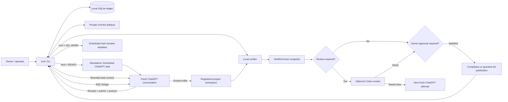

# Architecture

OrchKit is a local control plane for durable, scope-bounded development work performed across fresh ChatGPT conversations.

The core design separates transient model conversations from durable workflow authority.

## System model

- **`orch` CLI** — operator and worker entry point for setup, project registration, queue operations, verification, recovery, and publication.
- **Local SQLite ledger** — durable task, run, event, approval, snapshot, and publication state.
- **Private OrchKit artifacts** — capability files, receipts, logs, review exports, dispatcher data, and backups stored outside the project workspace.
- **Fresh ChatGPT worker** — performs the substantive development task for one claimed attempt.
- **RDC bridge** — connects the ChatGPT worker to the user's computer for the currently implemented automated workflow.
- **Registered project workspace** — the Git working tree in which the bounded task is performed.
- **Local verifier** — checks actual workspace scope, protected state, registered verification authority, and configured checks.
- **Optional Codex reviewer** — reviews frozen verified input when project/task policy requires model review.
- **Guarded publisher** — completes verified work or publishes exact verified content through configured Git policy.

## Durable context

Every task or repair attempt intentionally uses a new ChatGPT conversation.

Previous chat history is not the workflow database. OrchKit rebuilds bounded task context from local durable state for each new attempt. Retry feedback, verification state, project policy, and publication state remain available through the ledger even when the previous conversation has ended.

## High-level flow

## Authority boundaries

### Worker

The ChatGPT worker receives bounded task context and is expected to modify only allowed project paths. A worker receipt records what the worker claims to have changed, but that receipt is not treated as independent proof.

### Verifier

Verification is performed after the worker relinquishes its OrchKit capability. The verifier checks the actual workspace and configured checks rather than trusting the worker's statement that the task succeeded.

### Reviewer

Model review is optional. Current policy supports review being disabled, risk-triggered, or required. When Codex review is used, it is a reviewer of frozen input rather than the primary development worker.

### Publisher

Publication is separate from implementation and verification. Git publication requires the verified snapshot to remain current and follows the configured project policy.

## Project and writer isolation

Registered projects have a durable writer identity. OrchKit uses that identity to prevent overlapping active writer attempts that share the same underlying Git authority.

This is workflow coordination, not operating-system process isolation. See [Security model](security-model.md).

## Current platform boundary

The current implementation has been developed and validated primarily in a macOS-oriented environment with Python 3.9+.

Broader platform support should be documented only after it is independently verified.
